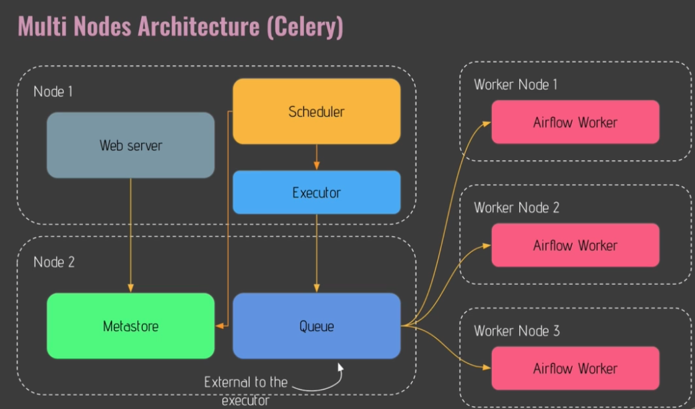
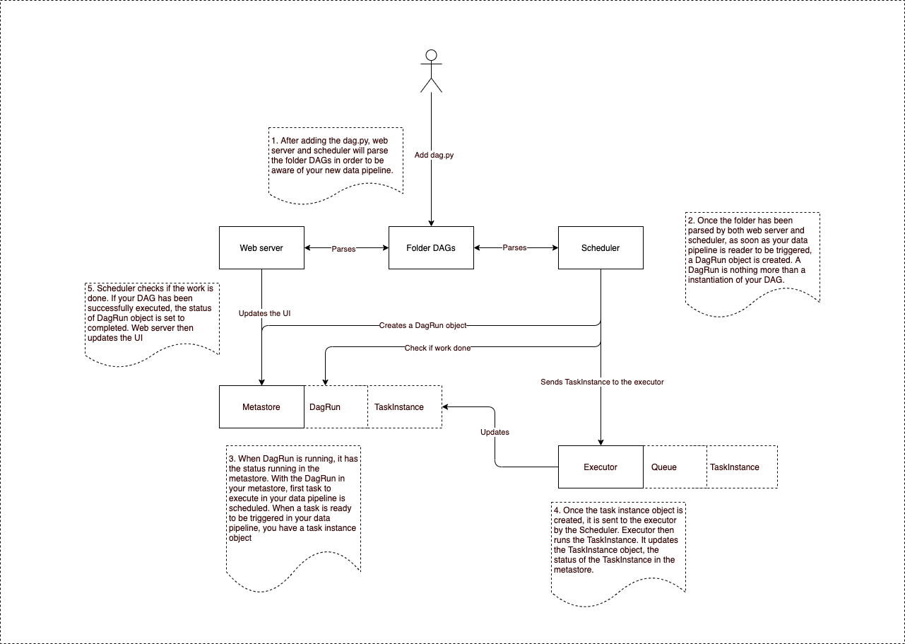

# play_with_airflow

## Why Airflow?
- Typical use case
  - Data pipeline to trigger every day at 10PM
    - ETL Job
      - Downloading the data
      - Processing the data
      - Storing the data
    - All the task might interact with other tools
      - Request API
      - Spark Job
      - Insert/Upsert/Overwrite
    - Have to make sure that other tools are available in order to ensure the data pipeline will succeed
    - What happen if the API is not available?
    - What happen if the Spark Job for some reason fails?
    - What happen if the DB is not available to make insert?
    - What happen if you have hundreds of such data pipelines to manage at the same time?
  - With Airflow, you will be able to manage and execute your data pipeline in a very reliable way, and you can monitor and retry your task automatically

## What is Airflow?
- A typical definition of Airflow is as followed
  - Apache Airflow is an open source platform to programmatically author, schedule and monitor workflows
- Airflow is an orchestrator allowing you to execute your tasks at the right time, in the right way, in the right order
  - It allows you to create data pipeline that will interact with many tools so that you can execute your tasks in the right way, at the right time, in the right order
- Benefits
  - Dynamic
    - Everything that you can do in Python, you can do it in your data pipeline. The possibilities are quite limitless.
  - Scalability
    - It is really scalable. You can execute as many tasks as you want in parallel. (Depending on your architecture or your resource)
  - User interface
    - You can monitor your data problems from it, retry your tasks etc.
  - Extensibility
    - If there is a new tool, and you want to interact with that new tool, you do not have to wait for Airflow to be upgraded. You can create your own plugin easily. 

## Core Components
1. Web server
   1. It is a Flask server with Unicorn serving the user interface
2. Scheduler
   1. Daemon in charge of scheduling workflows, task, data pipelines
   2. This is truly the heart of airflow, and you have to take care of it
3. Metastore
   1. Database where metadata are stored
   2. Usually Postgres as it is the recommended database to use with Airflow
4. Executor
   1. Class defining how your tasks should be executed
   2. If you have a k8s cluster, and you want to execute your tasks. Then you will use the k8s executor
   3. If you want to execute your tasks on the same machine by creating subprocesses, you will use the local executor
   4. If you want to execute your tasks on a celery cluster, then you will use the celery executor
   5. It defines how your tasks will be executed
5. Worker
   1. Process/sub process executing your task
   2. There is a different between an executor and the worker
      1. Executor define how the task should be executed
      2. Worker is actually the process executing the task

## Concept
1. DAG (directed acyclic graph)
   1. [1] -> [2] -> [3]
   2. A DAG is a data pipeline
2. Operator
   1. A wrapper around the task(the things you want to achieve)
   2. 3 different types of operator
      1. Action Operators
         1. Operators that execute functions or commands
         2. Bash Operator allows you to execute bash commands
         3. Python Operator allows you to execute Python functions
      2. Transfer Operators
         1. Allow you to transfer data between a source and a destination
      3. Sensor Operators
         1. Different from the other operator
         2. Waits for something to happen before moving to the next task
            1. Waiting for a file to land at a specified location, then you would use the file sensor. As soon as the file is there, you will move to the next task
3. Task/Task instance
   1. Task is an operator in your data pipeline
   2. Task instance 
      1. As soon as you trigger your data pipeline, a task becomes a task instance
      2. As soon as you execute an operator, that operator becomes a task instance
4. Workflow
   1. Combination of all the concept

## What Airflow is not?
- It is not a data streaming solution, neither a data processing framework
  - There is so many example using pandas in data pipelines, but you have to make sure that those dataframes won't end up with TB of data, otherwise you will end up with a memory overflow error. It is not optimized to do this.

## How Airflow works
- One node architecture
  - Web server
    - Fetch metadata from the metastore
  - Scheduler
    - Talk to the metastore and executor in order to send tasks that you want to execute
  - Metastore
  - Executor
    - Update the status of the tasks in the metastore
  - Queue
    - Inside the executor
    - Used to define the order in which your tasks will be executed
  - All running insider a single machine
  - This architecture is perfect for experiments or limited number of tasks that you want to execute
- Multi Nodes Architecture (Celery)
  - Node 1
    - Webserver
    - Scheduler
    - Executor
  - Node 2
    - Metastore
    - Queue
      - External to the executor not like in the single node architecture
      - This queue will be a third party tool like RabbitMQ 
  - Worker Nodes
    - Multiple nodes
    - Each node will have Airflow Worker running
      - Those Airflow Worker will be used in order to execute your tasks
      - Task will not be executed on Node 1 or Node 2.

      
1. As usual, Webserver fetches some metadata from the metastore. The status of your tasks, or any other metadata related to your data pipelines
2. Scheduler talking t the metastore as well as the executor in order to schedule the tasks
3. Executor will push the task you want to trigger in the queue
4. Once your task are in the queue, the Airflow Worker will fetch those tasks and will execute them on their own machine

## How it works
- Single node architecture


## Hands on notes
- pip install needs to include constraint so packages that airflow depends on will not get upgrade and break things
- Doing ```airflow db init``` helps to set up all the required stuff, database, folders, etc.
  - airflow.cfg is the configuration file for airflow 
  - airflow.db is the database used by default, which is sqlite
  - log directory where logs are store, logs of your task, executor
  - unittest.cfg can be useful if you want to test some configuration settings of your airflow without impacting your airflow instance
  - webserver_config.py is useful to configure your web server
- create a user to access webserver
  - ```airflow users -h```  to look at the airflow user help command
  - ```airflow users create -u admin -p admin -f cj -l ong -r Admin -e admin@airflow.com``` 
- Some other important command
  - ```airflow db init``` execute to initialize airflow. it initializes the metastore of airflow and the files and folders needed by airflow
  - ```airflow db upgrade``` upgrade your airflow version
  - ```airflow db reset``` dangerous. make sure you know what you are doing before executing that command as you will lose everything; metadata in metastore 
  - ```airflow webserver``` use to start the user interface of airflow
  - ```airflow scheduler``` used to start the scheduler
  - ```airflow dags list``` to list all the dags
  - ```airflow tasks list <dagID>```  to list all the task in the selected DAG. this can be useful to ensure you didnt make any mistake in your data pipeline. if some task did not show up, you might have a parsing error.
  - ```airflow dags trigger -e 2020-01-01 <dagID>``` this command allows you to trigger your data pipeline with an execution date

## Web UI
- You have to use the command line interface of airflow in some cases, such as for creating the first user of airflow, or for testing a specific task in your data pipeline with impacting the metadatabase
- Now if you want to get some statistic about your task, like which task are taking too much time, or if your tasks are able to be executed in parallel?
  - This is where you will need to use the UI 
- UI is useful to get information of your task, or about how your data pipeline behave, or even identify if some tasks are in trouble
- DAGs view
  - all the details problems taken into account by airflow
  - Pause or unpause the dags with the button
    - You have to turn the toggle on if you want to start scheduling your data pipeline(even if you want to trigger it manually)
  - Name of the DAGs and their tags
    - This can be useful if you have multiple data pipeline that you want to identify with categories
  - Owner of the data pipeline
    - can also be the name of your team; data scientist/engineer
  - Run correspond to the DAGs run status; success, running or failed
    - From here you will know the status of the past and current DAG runs
  - Schedule indicate the frequency at which your data pipeline is triggered
    - indicate by cron
  - Last run correspond to the execution date
  - Status of the recent tasks
    - Useful to see the status of the task for the last DAGs run
      - queued; not yet schedule
      - none; not yet schedule nor queue, will be triggered
  - Action
    - Trigger
    - Refresh
    - Delete; it wont delete the file, but only all the metadata related to it in the metastore
- Tree view
  - useful if you want to get the history of the past and current DAGs run
  - Circles correspond to the DAG runs
  - Squares correspond to the tasks
- Graph view
  - Boxes is the task of your data pipeline
  - arrow is the dependency between the tasks
- Gant view
  - useful if you want to spot bottlenecks
  - check if the task can execute in parallel
- Task view
  - Clicking on the task gives more information and features
    - Clear; you can clear your task, which is super important if you want to return or retry the the given task
    - Mark failed/success; you can mark the either with either success or failure inorder to know how the next tasks will behave according to the status you defined

## Creating your DAG
- if your airflow working directory do not have dags directory, create one. This is where all your DAGs.py is placed
  - You need to import DAG object in the python script. ```from airflow.models import DAG```. It is used to create the data pipeline
  - Next thing to import is datetime. ```from datetime import datetime```. datetime object will be useful to specify a date we need to specify
  - ```default_args = {'start_date': datetime(2020, 1, 1)}```
    - creates a dictionary which specify all the argument that is common to all of your task in your data pipeline
      - Number of times your task should retry
      - start date, etc.
    - Each operator, each task might have a different args. in this case all the operator has the same start_date
  - With the two object above, we are already to instantiate a DAG
    - ```with DAG(<dag_id>, schedule_interval='@daily'', default_args=default_arg catchup=False) as dag```
    - dag_id must be unique across all the dag
  - An operator is a task in your data pipeline
    - Do not put two task in a single operator
      - Example, a PythonOperator doing cleaning data and processing data
      - Instead, use 2 PythonOperator instead
        - Because if processing data didn't works expected, you will have to retry/redo cleaning as well even though it has successfully executed
    - There are three type of operator
      - Action
        - Correspond all operator executing a function
        - Python
        - Bash
        - So on
      - Transfer
        - related to any operator transferring data from a source to destination
      - Sensor
        - Wait for a condition to be met
  - Each task must have a unique id
  - When an Operator is not available, we can just install it.
    - Airflow is provided as multiple separated but connected packages
    - When installing airflow for the first time, it brings the minimum operators or sensors that you might need
    - Different providers are Spark, AWS, Databrick, etc.
    - Airflow has more than 700 operators
      - Before Airflow 2, all operators were backed into the same gaint python packages
```
Let's say there was a bug in the S3KeySensor. Or a new feature of S3 just came out and you want to use it. With Airflow 1.10.x you had to wait for the next Airflow update to get your S3KeySensor fixed or updated! So, in order to get the latest version of your Operator, you had to literally upgrade your Airflow version. As you can imagine, with the growing number of Operators, it wasn't sustainable at all.

Operators were tied up to the Apache Airflow Core.

With Airflow 2.0, this is over!

Airflow 2.0 is composed of multiple separated but connected packages with a Core package apache-airflow and providers.

A provider is an independent python package that brings everything your need to interact with a service or a tool such as Spark or AWS.

It contains connection types, operators, hooks and so on.

By default, some operators are pre installed by default such as the PythonOperator and the BashOperator but for the others you will have to install the corresponding prodiver.

Now, you can install only the operators you need (no more 200 different dependencies to deal with whereas you just use 3 or 4 operators). If there is a new version of your operator, you just have to update the provider and not your Airflow instance like before. On top of that, it's never been easy to create your own provider.
```
  - Each time you add a new task in your data pipeline, there is always one thing that you have to have, and this is testing your task
    - ```airflow tasks test <dag_id> <task_id> <date>```
      - This allows you to test a specify task without checking for the dependency
      - It also does not store any metadata related to that task
      - It is best practice to always test when there is a new task
  - How can we fetch the results from the previous task?
    - XCOM
    - You can pass task instance around and access the task instance object. In the task instance object, we can access the XCOM.
    - You can think of XCOM as a way to share data between your tasks in Airflow
    - When a previous task completes, it will store the XCOM in the metastore of Airflow
      - It is a key value pair
        - Key is define by Airflow
        - Value is define by the tasks (indirectly you since you define the task)
      - Your next task can do xcom_pull to fetch the XCOM
  - Indicate your dependency with ```>>```

## DAG Scheduling
- This is an important concept to understand how your DAGs are scheduled
- Whenever you define a DAG, there are two agreements that you will always define.
  - start_date
    - Defining when your DAG will start being scheduled
  -schedule_interval
    - Defining the frequency your DAG will be triggered
- Your data pipeline will be effectively triggered once the start_date + schedule_interval is elapsed
  - After it is elapsed, you will get an execution_date corresponding to the beginning of that period
- Catch up is default to true
  - Automatically, Airflow will run all the non-triggered DAG runs between the execution date and current date.
  - If there is no execution date, then start_date is referenced
- All dates in Airflow are in UTC

## Default configuration
- When you run airflow for the first time, you get the default configuration
- How many tasks can I execute in parallel with that default configuration?